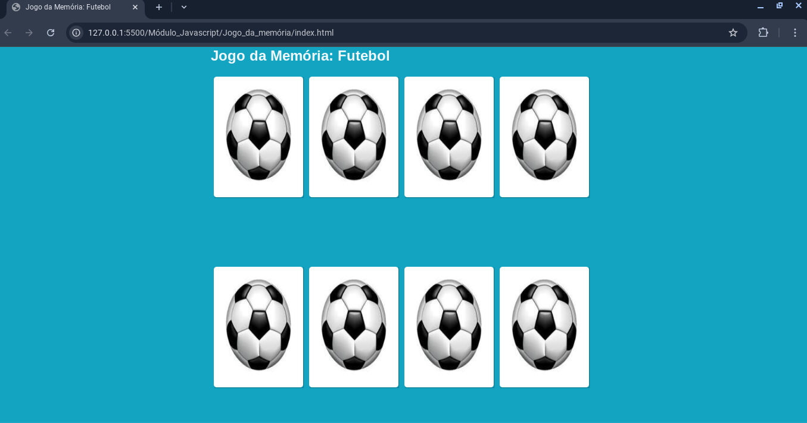

# Jogo da Memória: Futebol

Um jogo da memória temático de futebol, onde o objetivo é encontrar todos os pares de cartas correspondentes. Desenvolvido com HTML, CSS e JavaScript.



---

## 🚀 Como Jogar

1. **Clique em uma carta** para virá-la e revelar a imagem.
2. **Encontre o par correspondente** clicando em outra carta.
3. Se as cartas forem iguais, elas permanecem viradas.
4. Se forem diferentes, elas são desviradas após 1 segundo.
5. **Continue até encontrar todos os pares** e completar o jogo!

---

## 🛠️ Tecnologias Utilizadas

- **HTML**: Estrutura do jogo e cartas.
- **CSS**: Estilização e animações (efeito de virar as cartas).
- **JavaScript**: Lógica do jogo (virar cartas, verificar pares, etc.).

---

## 🎨 Estrutura do Projeto

```bash
jogo_da_memoria/
├── assets/
│ ├── css/
│ │ └── style.css # Estilos do jogo
│ ├── images/
│ │ ├── cbf.jpg # Imagem da CBF
│ │ ├── ceara.jpg # Imagem do Ceará
│ │ ├── corinthians.jpg # Imagem do Corinthians
│ │ ├── realmadrid.jpg # Imagem do Real Madrid
│ │ └── versoCarta.jpg # Imagem do verso das cartas
│ └── js/
│ └── script.js # Lógica do jogo
├── index.html # Página principal do jogo
└── README.md # Documentação do projeto
```

---
